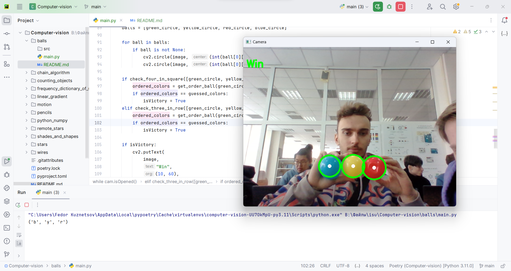
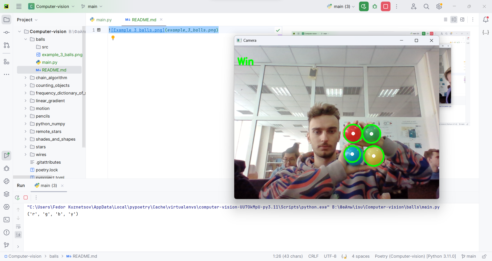

# Цветные шарики

Компьютер загадывает последовательность из 3(4) цветов. Необходимо сделать так, чтобы если пользователь показывает
верную последовательность в камеру на экран было выведено слово "Win".

1. Последовательность шаров (три шара по горизонтали)

2. Последовательность шаров (четыре шара 2 на 2)

