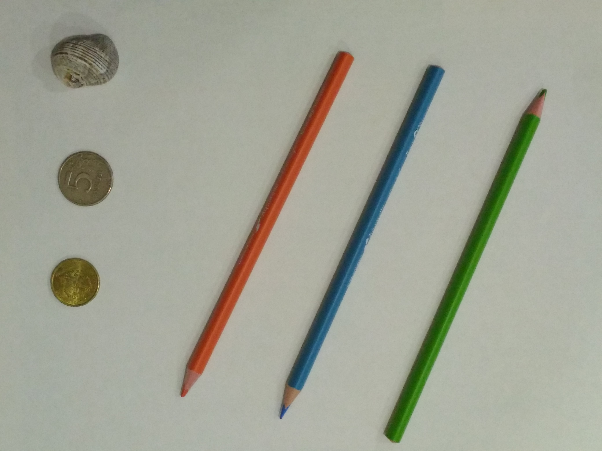
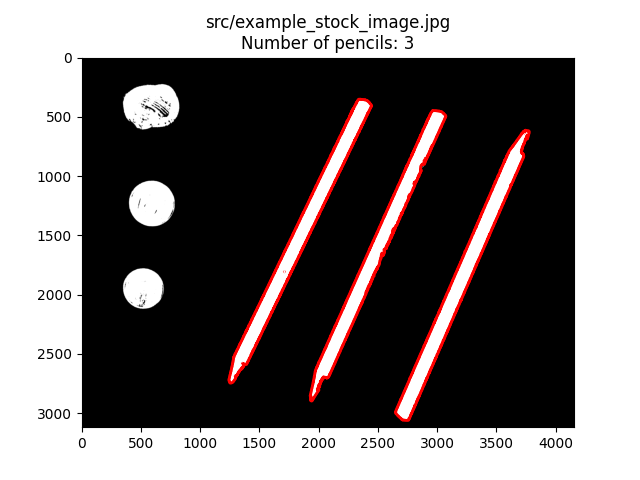

# Карандаши

Написать программу для определения количества карандашей на наборе изображений.

Вход: набор изображений.

Выход: число, суммарное количество карандашей на всех изображениях.

Пример:

| Исходное изображение                                                          | Обработанное изображение                                                              |
|-------------------------------------------------------------------------------|---------------------------------------------------------------------------------------|
|  |  |
