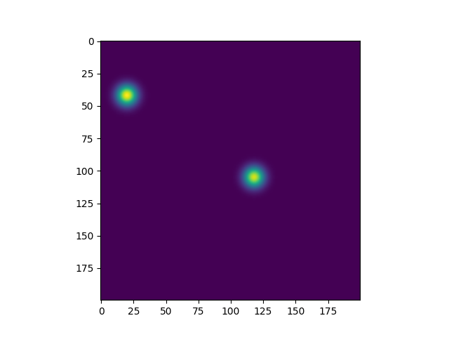

Необходимо определить расстояние между точками, расположенными на одном изображении. Результат округлить до одного знака
после запятой. Повторить до тех пор, пока не будут обработаны 10 изображений.

Пример изображения:

