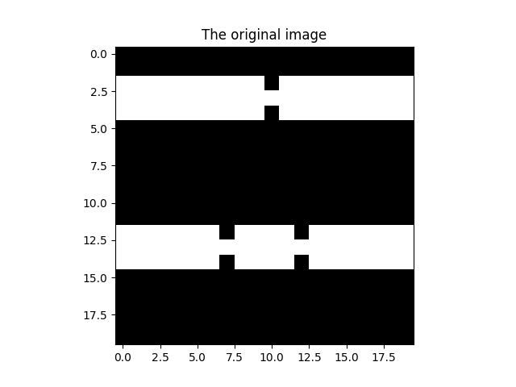

# Провода

Даны изображения проводов.
Необходимо определить порван провод или нет.
Если да, то насколько частей.

Провод толщиной три пиксела
Проводов на изображении может быть несколько, то обрыв определить для каждого провода отдельно.

ПРИМЕР ИЗОБРАЖЕНИЯ

